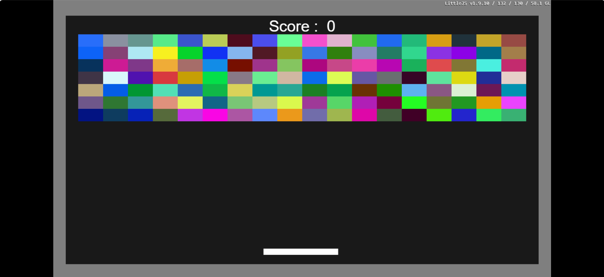
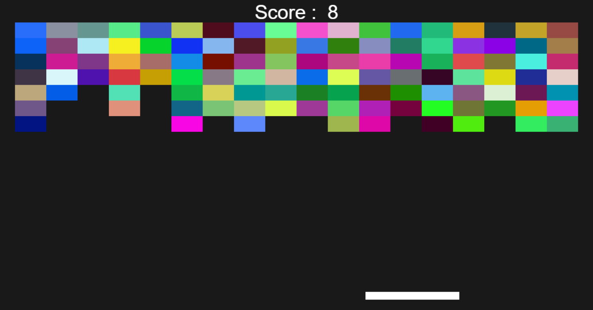

## Brick Game
This is a simple Brick Game created using the LittleJS engine. In this game, the user can control the paddle using the mouse and start the game by clicking anywhere on the screen.

# Features
Mouse Control: Control the paddle using your mouse for smooth gameplay.
Start on Click: Start the game by simply clicking anywhere on the screen.
Basic Game Mechanics: The objective is to break the bricks by bouncing the ball using the paddle.

# Link
[Play it](https://anant-02.github.io/BrickGame/)
